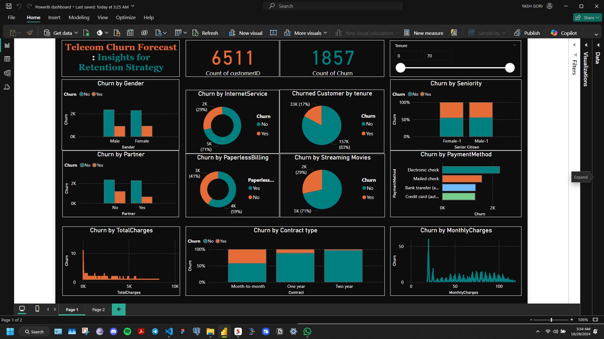

# customer-churn-detection

# Overview
This repository contains the code, research publication, Power BI dashboard, and datasets for the project titled "Predictive Modeling of Customer Churn in the Telecommunication Industry: A Python-Based Approach." The goal of this project is to analyze customer churn using advanced machine learning techniques and provide actionable insights to mitigate churn effectively.

# Project Structure
Code: Python scripts used for data preprocessing, model building, and evaluation.
Research Publication: A detailed research paper outlining the methodology, analysis, and findings of the study.
Power BI Dashboard: Visualizations created to present the key insights and results of the churn analysis.
Datasets: The raw and processed datasets used for model training and evaluation.

# Methodology
1. ### Data Cleaning:
  - Missing value imputation
  - Categorical variable encoding
2. ###  Model Building
- Building and optimizing a Random Forest classifier

3. ### Model Evaluation:
- Performance metrics: Accuracy, Precision, Recall, F1-Score, ROC-AUC
- Feature importance analysis

# Results
The Random Forest model achieved a high accuracy of approximately 94% on the test data. The Power BI dashboard provides interactive visualizations to explore the results and gain insights into the factors influencing customer churn.
- Power BI dashboard to present insights and results
- 

